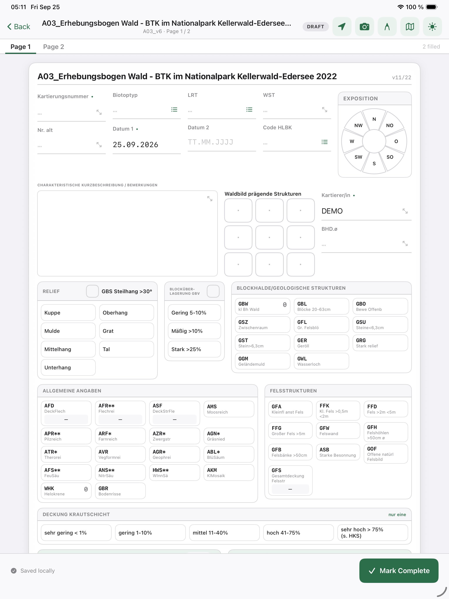
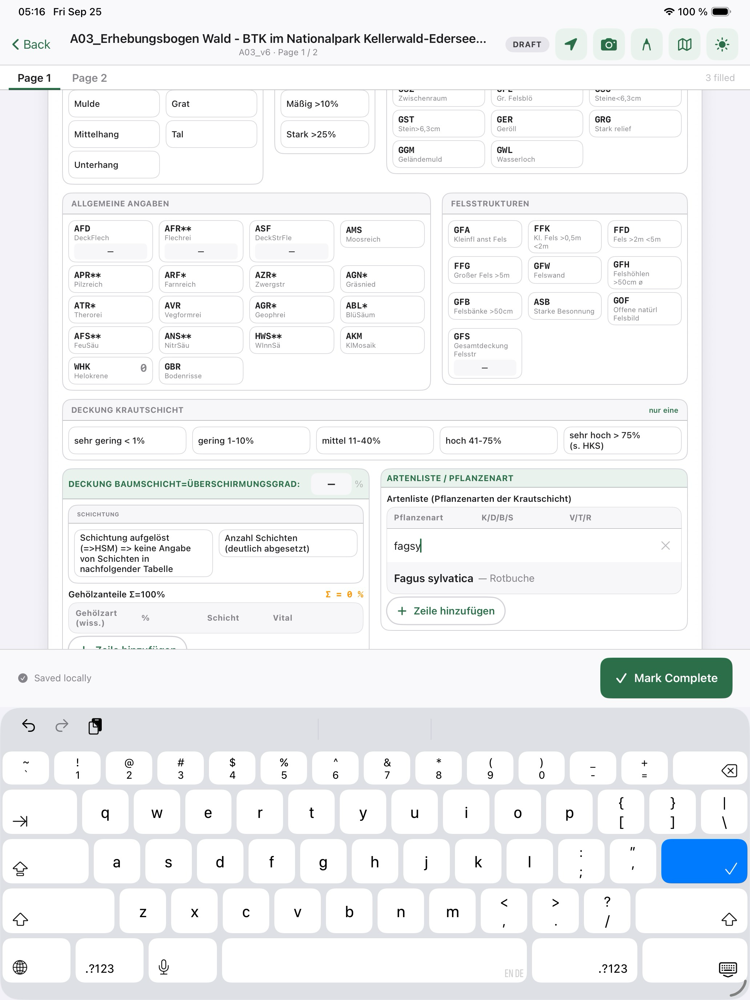

# HLBK Form Digitizer

Gets German ecological survey forms (A03 Kartierbögen) into the HLBK database by two routes: a Flask web tool that extracts handwritten paper forms with Anthropic's image API and matches species names against a 21,518-species reference, and Field Tablet, a native iPad app for entry in the field. An operator reviews every result before it is saved.

**Tech:** Python · Flask · Anthropic API (vision) · RapidFuzz · SpatiaLite · Swift/SwiftUI · Core Data · PencilKit

The web tool is deployed as an internal tool; both the web and iPad code are private.

## The problem

Ecological survey forms record species observations, habitat details, and site metadata on paper. Transferring these records into the HLBK database requires someone to interpret handwriting and check the transcription, especially when species names are abbreviated or misspelled.

## The solution

There are two entry routes. Scanned paper forms go through image-based extraction before review. Field Tablet captures entries directly on an iPad and syncs them into a web workspace for review. An operator checks and corrects the results before saving them to the database.

For paper transcription, an operator estimated 10–15 minutes for manual entry per form, compared with 2–3 minutes for review and correction of extracted results. These are task estimates, not benchmark results or total processing times.

## Architecture

A Python and Flask application connects image-based extraction through Anthropic's API with RapidFuzz species matching and a browser-based review interface. Results are stored on the server. SpatiaLite provides the connection to the HLBK database.

## Features

### Species matching

The reference database contains 21,518 species. RapidFuzz WRatio matching scores are grouped into three tiers: at least 90, 70–89, and below 70. A high score means the names are similar, not that the identification is correct.

### Human review

Extraction produces a draft transcription. The operator checks and corrects it before saving, with species-name matching helping to identify entries that need attention.

### Batch processing

Batch extraction uses bounded concurrency rather than processing every form sequentially.

## Field Tablet

Field Tablet is a native SwiftUI iPad app for entering surveys in the field. It follows the shared A03 template and keeps sessions and cached templates in Core Data for offline entry. A species catalog supports name selection; PencilKit ink and photos capture supporting observations. Location capture includes point GPS and foreground tracks with consent.

Sessions move through Draft, Completed, and Synced states. Completed sessions sync over authenticated HTTP into the web tool's workspaces. The app normalizes the digital fields to the shared payload format and sends them with `validated: false` for downstream review. These fields do not require the paper-scan extraction step.

An end-to-end offline-to-production round trip has not been verified.

*A03 form entry. iPad simulator, synthetic survey data.*

*Species autocomplete: fagsy → Fagus sylvatica (Rotbuche). iPad simulator, synthetic survey data.*

The displayed Nationalpark Kellerwald-Edersee 2022 title belongs to the form template, not a captured survey location.

## Tech stack

### Web tool

- Python 3.12+ and Flask
- Anthropic image inputs for extraction
- RapidFuzz for species-name matching
- SpatiaLite for database integration
- Browser-based review and server-side storage

### Field Tablet

- SwiftUI for the native iPad interface
- Core Data for local sessions and template caching
- PencilKit for ink input
- Authenticated HTTP sync to web workspaces

## Data flow

- Paper: scanned form → extraction → species matching → workspace review and correction → database save.
- Field Tablet: native field entry → local session → authenticated workspace sync → review and correction → database save.

## Cost considerations

API costs for paper-form extraction depend on the model and the amount of input and output.

## License

This is a portfolio case study. The source code is in a private repository.

If you're interested in the technical details or would like to discuss the implementation, feel free to reach out.

---

*Built by [Jannis Menzler](https://github.com/jmenzler)*
